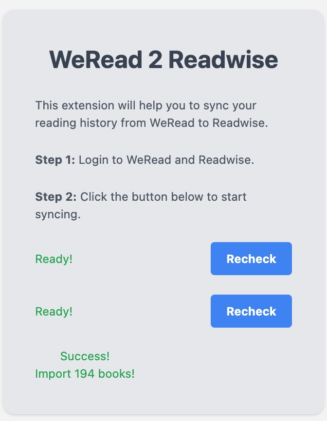
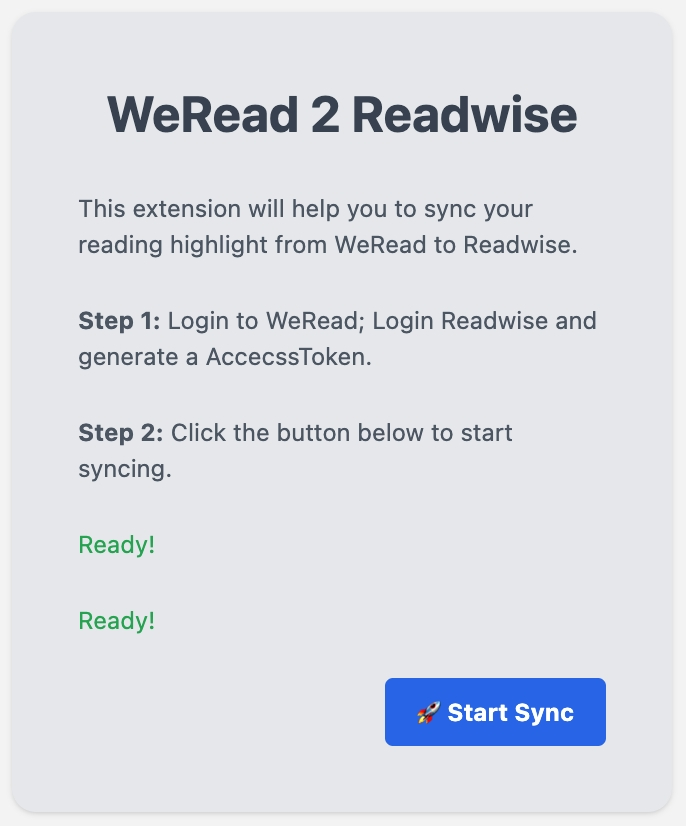
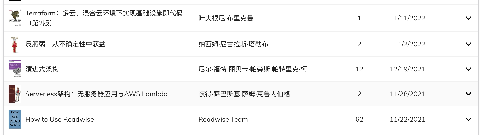

<h1 align="center">Welcome to wereadwise 👋</h1>

  
  
  
  
  

> Change Weread hightlight 2 Readwise

### 🏠 Homepage

> Fork by curl https://github.com/abhijithvijayan/web-extension-starter 🙏
## Demo

## Prerequisites

- node >=10.0.0
- yarn >= 1.0.0

## Install
Download from [release]("http://github.com/fuergaosi233/wereadwise/release") or build by yourself

## Author

👤 **holegots**

* Twitter: [@fuergaosi](https://twitter.com/fuergaosi)
* Github: [@fuergaosi233](https://github.com/fuergaosi233)

## Show your support

Give a ⭐️ if this project helped you!

***
_This README was generated with ❤️ by [readme-md-generator](https://github.com/kefranabg/readme-md-generator)_